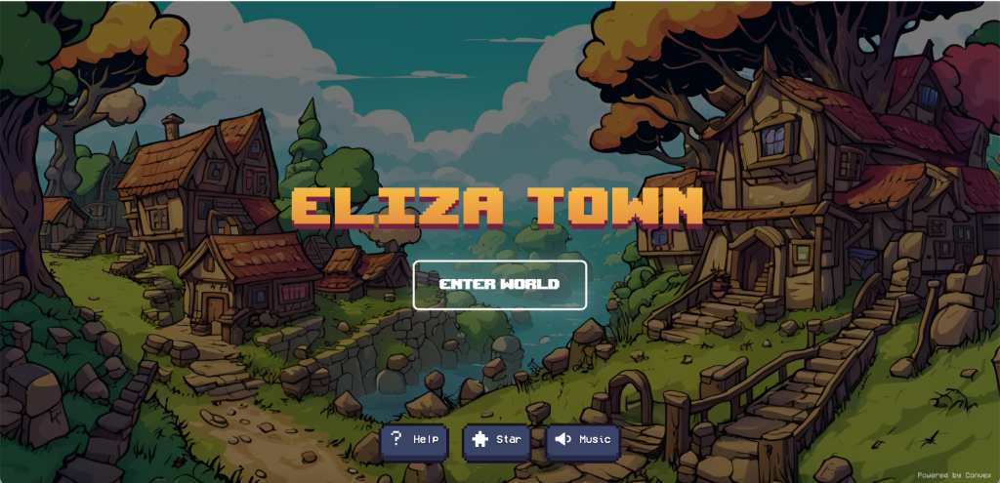

# Eliza Town 🏠💻💌

> A fork of [AI Town](https://github.com/a16z-infra/ai-town) powered by [ElizaOS](https://github.com/elizaOS/eliza).



**Eliza Town** is a virtual world where players can create their own unique **ElizaOS Agents** and watch them live, interact, and evolve autonomously in a pixel-art town.

Unlike standard AI Town, **Eliza Town** integrates the powerful [ElizaOS framework](https://github.com/elizaOS/eliza), allowing for:
- 🧠 **Deep Personality**: Create agents with distinct personalities, bios, and styles.
- 🎨 **Visual Customization**: Choose from diverse pixel art sprites for your agents.
- 🗣️ **Real Interaction**: Chat with your agents and watch them interact with each other using the ElizaOS engine.
- 🔗 **External Connection**: Your in-game agents run on your own ElizaOS instance (ElizaCloud, Railway, or local).

## 🚀 Key Features

- **Connect Custom Agents**: Use the in-game UI to attach existing ElizaOS agents to the world.
- **MMO Experience**: (Coming Soon) Persistent world where players can visit each other's towns.
- **Dynamic Conversations**: Agents remember history and context thanks to ElizaOS's memory system.

## 🛠️ Stack

| Component | Technology |
|-----------|------------|
| Agent Engine | [ElizaOS](https://github.com/elizaOS/eliza) |
| Game Engine & Database | [Convex](https://convex.dev/) |
| Rendering | [PixiJS](https://pixijs.com/) |
| Authentication | [Clerk](https://clerk.com/) (Optional; otherwise some actions require a dev flag) |
| Music Generation | [Replicate](https://replicate.com/) |

---

## 🏁 Installation Guide

### Prerequisites

- **Node.js 18+** (We recommend using [nvm](https://github.com/nvm-sh/nvm))
- A **[Convex](https://convex.dev/)** account (free tier available)

### Step 1: Clone & Install

```bash
git clone https://github.com/cayden970207/eliza-town.git
cd eliza-town
npm install
```

### Step 2: Configure Convex Backend

1. Initialize Convex (this will prompt you to log in if needed):
   ```bash
   npx convex dev
   ```
   This starts the development backend and syncs your functions.

2. Set environment variables in the Convex Dashboard or via CLI:
   ```bash
   # Required: ElizaOS Server URL (ElizaCloud, Railway, or local)
   # Example: https://your-elizacloud-url, https://your-railway-url, or http://localhost:3000
   npx convex env set ELIZA_SERVER_URL "https://your-elizacloud-url"

   # Optional: If your ElizaOS server requires an API key
   # This is sent as X-API-KEY for all /api/* requests
   npx convex env set ELIZA_SERVER_AUTH_TOKEN "your-eliza-api-key"
   
   # Optional: For character generation features
   npx convex env set GOOGLE_API_KEY "your-google-api-key"
   npx convex env set REPLICATE_API_TOKEN "your-replicate-token"
   ```

### Step 3: Run the Game

Start the frontend development server:
```bash
npm run dev
```

#### Dev tip: run without login

Some actions (sprite upload, character generation, certain build/save actions) require authentication.
If you haven't set up Clerk yet, you can unblock local development by allowing unauthenticated edits:

```bash
ALLOW_UNAUTHENTICATED_TOWN_EDIT=1 npm run dev
```

This is meant for local dev only.

Optional: seed default agents during init by setting `AUTO_SPAWN_AGENTS`:
```bash
AUTO_SPAWN_AGENTS=1 npm run dev
```
Use a number to control the count, e.g. `AUTO_SPAWN_AGENTS=5`.

Visit **http://localhost:5173** to enter Eliza Town!

---

## 🔌 ElizaOS Server Configuration

By default, Eliza Town connects to a **shared ElizaOS server** hosted by the project maintainers. Override with `ELIZA_SERVER_URL` to use ElizaCloud, Railway, or local.

To work with this app, your ElizaOS server must:
- Expose the REST API endpoints used here: `POST /api/agents` and `POST /api/agents/:id/message`.
- Have an LLM provider configured so agent creation and chat succeed.
- Be reachable from Convex (local URL works with `npx convex dev`; deployed apps need a public URL).
- If you set `ELIZA_SERVER_AUTH_TOKEN` on the ElizaOS server, set the same value in Convex (or enter a per-agent API key when creating the agent).

### Using Your Own ElizaOS Server (Optional)

If you want full control over your agents or want to customize the AI behavior:

1. **Deploy ElizaOS** using one of these methods:
   - ElizaCloud (recommended)
   - [Railway](https://railway.app/)
   - [Docker](https://github.com/elizaOS/eliza#docker)
   - Local installation (see [ElizaOS docs](https://elizaos.github.io/eliza/))

2. **Update the environment variable:**
   ```bash
   npx convex env set ELIZA_SERVER_URL "https://your-eliza-server.com"
   ```

3. **Ensure your ElizaOS server has an LLM configured** (e.g., OpenAI API key).

### Embedding Dimension (Convex)

The embeddings index dimension is configurable via env:

```bash
# OpenAI embeddings
npx convex env set EMBEDDING_DIMENSION 1536

# Together.ai embeddings
npx convex env set EMBEDDING_DIMENSION 768

# Ollama embeddings (default)
npx convex env set EMBEDDING_DIMENSION 1024
```

Convex schema evaluation cannot read env vars directly, so we generate a static
config file before dev runs. `npm run dev` already runs this step.

To update the dimension manually (e.g., before `npx convex deploy`):

```bash
EMBEDDING_DIMENSION=1536 node scripts/set_embedding_dimension.mjs
```

Note: changing the dimension requires regenerating embeddings (wipe `memories` + `memoryEmbeddings`) because the vector index dimension must match.

---

## 🐺 Werewolf MCP Server (Remote Agents)

To let ElizaCloud or other remote agents join Werewolf via MCP tools, run the MCP server over HTTP + SSE:

```bash
MCP_TRANSPORT=sse CONVEX_URL=<your_convex_url> npm run mcp:werewolf
```

Then point each agent's MCP config to:

```
http://<host>:8787/mcp?playerId=<playerId>
```

If `playerId` is missing, the session is treated as a spectator (read-only).

---

## 🧪 E2E Werewolf Agent (Messaging Sessions API)

- Confirmed agent ID: `c7cab9c8-6c71-03a6-bd21-a694c8776023` (from `GET /api/agents`)
- Verified response: "Hello! Yes, I can hear you. How can I assist you today?"
- Recommended path: use the Messaging Sessions API (`/api/messaging/sessions/...`)

Copy/paste flow:
```bash
BASE_URL="https://fliza-agent-production.up.railway.app"
AGENT_ID="c7cab9c8-6c71-03a6-bd21-a694c8776023"
USER_ID=$(uuidgen | tr 'A-Z' 'a-z')

# 1) Create a session (copy sessionId from the response)
curl -sS -X POST "$BASE_URL/api/messaging/sessions" \
  -H "Content-Type: application/json" \
  -d "{\"agentId\":\"$AGENT_ID\",\"userId\":\"$USER_ID\"}"

# 2) Send a message (replace SESSION_ID)
SESSION_ID="PASTE_SESSION_ID"
curl -sS -X POST "$BASE_URL/api/messaging/sessions/$SESSION_ID/messages" \
  -H "Content-Type: application/json" \
  -d "{\"content\":\"Hello E2E Werewolf 1\"}"

# 3) Read replies (poll)
curl -sS "$BASE_URL/api/messaging/sessions/$SESSION_ID/messages?limit=20"
```

If the server requires auth, add this header to each request:
`-H "X-API-KEY: your-key"`.

Tiny chat loop script:
```bash
./scripts/werewolf_chat.sh
# Overrides (optional):
BASE_URL="https://fliza-agent-production.up.railway.app" \
AGENT_ID="c7cab9c8-6c71-03a6-bd21-a694c8776023" \
API_KEY="your-key" \
./scripts/werewolf_chat.sh
```

---

## ⏱️ Werewolf Timing Configuration

All Werewolf phase and round timeouts are configurable via Convex env vars (milliseconds).

Round timing:
- `WEREWOLF_ROUND_DURATION_MS` (default `15000`)
- `WEREWOLF_ROUND_BUFFER_MS` (default `5000`)
- `WEREWOLF_ROUND_RESPONSE_TIMEOUT_MS` (default `10000`)

Phase timing (per phase override):
- `WEREWOLF_PHASE_MS_LOBBY`
- `WEREWOLF_PHASE_MS_NIGHT`
- `WEREWOLF_PHASE_MS_DAY_ANNOUNCE`
- `WEREWOLF_PHASE_MS_DAY_OPENING`
- `WEREWOLF_PHASE_MS_DAY_DISCUSSION`
- `WEREWOLF_PHASE_MS_DAY_VOTE`
- `WEREWOLF_PHASE_MS_DAY_RESOLUTION`
- `WEREWOLF_PHASE_MS_ENDED`

If a phase override is not set, phases with rounds derive their duration from
`WEREWOLF_ROUND_DURATION_MS * roundCount` so the timing scales cleanly.

Example (faster show pacing):
```bash
npx convex env set WEREWOLF_ROUND_DURATION_MS 8000
npx convex env set WEREWOLF_ROUND_BUFFER_MS 2000
npx convex env set WEREWOLF_ROUND_RESPONSE_TIMEOUT_MS 5000
npx convex env set WEREWOLF_PHASE_MS_LOBBY 8000
npx convex env set WEREWOLF_PHASE_MS_DAY_ANNOUNCE 8000
npx convex env set WEREWOLF_PHASE_MS_DAY_RESOLUTION 8000
```

Tip: keep `WEREWOLF_ROUND_RESPONSE_TIMEOUT_MS` comfortably below
`WEREWOLF_ROUND_DURATION_MS - WEREWOLF_ROUND_BUFFER_MS` to avoid overlap.

## 🤖 Creating Agents

1. Click the **"New Agent"** button in the top menu.
2. **Select a Sprite**: Browse the carousel to pick a pixel art avatar.
3. **Define Personality**: Choose tags (e.g., Friendly, Mysterious) and write a Bio.
4. **Connect ElizaOS**: Enter your Eliza server URL, load agents, and pick the one you want.
5. **Connect**: Click connect, and your ElizaOS agent will appear in the world!

---

## 🧑‍💻 Contributing

We welcome contributions! Here's how to get started:

1. Fork the repository
2. Create a feature branch: `git checkout -b feature/my-feature`
3. Make your changes
4. Run tests: `npm test` (if available)
5. Submit a Pull Request

## Tests

- Unit tests: `npm test`
- E2E (Playwright): `npm run test:e2e` (uses a dedicated local Convex + ElizaOS; see `TESTING.md`)
- E2E UI runner: `npm run test:e2e:ui`

E2E coverage includes landing page actions, character creation/deletion, agent creation/removal,
join/release flows, conversations (invite/accept/reject/message/leave), movement, and a full
Werewolf match run.
Playwright E2E runs automatically on pull requests.

### Project Structure

```
├── convex/          # Backend functions and schema
│   ├── elizaAgent/  # ElizaOS integration
│   └── agent/       # Conversation logic
├── src/
│   ├── components/  # React components
│   └── lib/         # Utilities and registries
├── data/            # World data and maps
└── public/assets/   # Runtime assets (sprites, tilesets)
```

---

## Credits

This project stands on the shoulders of giants:
- **[AI Town](https://github.com/a16z-infra/ai-town)** - The original base (MIT License)
- **[ElizaOS](https://github.com/elizaOS/eliza)** - The agent framework
- **[PixiJS](https://pixijs.com/)** - Rendering engine
- Assets by [George Bailey](https://opengameart.org/content/16x16-game-assets), [Hilau](https://opengameart.org/content/16x16-rpg-tileset), and [Ansimuz](https://opengameart.org/content/tiny-rpg-forest)

---

## License

This project is licensed under the MIT License - see the [LICENSE](LICENSE) file for details.
